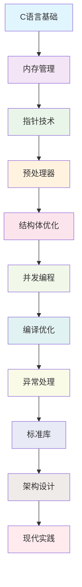

# 🚀 C语言大师进阶系列


<div align="center">
  <p>深度解析C语言内核机制与高级编程技巧</p>
  <p><em>从底层原理到现代实践的完整技术体系</em></p>
</div>

---

## 📚 系列概览

本系列是专为C语言进阶开发者设计的技术深度解析，涵盖10个核心主题，总计超过15万字的技术内容。每篇博客都深入探讨C语言的高级特性、底层原理和最佳实践。

### 🎯 学习目标

- 🏗️ 掌握C语言底层内存管理和优化策略
- 🔧 理解编译器优化机制和性能调优
- ⚡ 实现高性能并发和无锁数据结构
- 🛠️ 构建现代化的C语言开发工具链
- 🏛️ 设计可扩展的软件架构模式

---

## 📖 博客列表

### 1. [C语言内存管理深度解析](./blog_01_memory_management.md)
🗂️ **堆栈、内存池与优化策略**

- 动态内存分配与释放的底层实现
- 自定义内存池和垃圾回收机制
- 内存碎片整理和性能优化
- 内存泄漏检测和调试工具

```c
// 自定义内存分配器示例
typedef struct memory_pool {
    void* pool_start;
    size_t pool_size;
    block_header_t* free_list;
    pthread_mutex_t pool_mutex;
} memory_pool_t;
```

### 2. [C语言指针高级技巧](./blog_02_pointers.md)
🎯 **多级指针、函数指针与内存布局**

- 指针算术和内存对齐原理
- 多级指针的实际应用场景
- 函数指针和回调机制设计
- 指针类型安全与转换技巧

### 3. [C语言预处理器黑科技](./blog_03_preprocessor.md)
⚙️ **宏编程、X-Macro与代码生成**

- 高级宏编程技术
- X-Macro模式的实际应用
- 编译时代码生成机制
- 条件编译和平台适配

### 4. [C语言结构体与位字段](./blog_04_structs_bitfields.md)
📊 **内存对齐、数据打包与性能优化**

- 结构体内存布局分析
- 位字段和网络协议设计
- 缓存友好的数据结构
- 内存对齐和性能优化

### 5. [C语言并发编程](./blog_05_concurrency.md)
🔄 **原子操作、内存屏障与无锁数据结构**

- 多线程同步机制实现
- 原子操作和内存屏障原理
- 无锁数据结构设计模式
- 线程池和任务调度系统

### 6. [C语言编译器优化](./blog_06_compiler_optimization.md)
⚡ **链接时优化、内联汇编与性能调优**

- 编译器优化级别和策略
- 链接时优化（LTO）技术
- 内联汇编和平台特定优化
- PGO和自动向量化

### 7. [C语言异常处理机制](./blog_07_exception_handling.md)
🛡️ **setjmp/longjmp与错误处理模式**

- 非局部跳转机制原理
- 错误处理模式设计
- 资源管理和异常安全
- 现代错误处理最佳实践

### 8. [C语言标准库深度剖析](./blog_08_stdlib.md)
📚 **IO缓冲区、字符串处理与算法实现**

- 标准库内部实现机制
- IO缓冲区和流操作原理
- 字符串处理算法优化
- 自定义标准库组件

### 9. [C语言架构设计](./blog_09_architecture.md)
🏛️ **模块化编程、接口设计与代码组织**

- 模块化设计原则
- 接口设计和抽象机制
- 设计模式在C语言中的实现
- 依赖注入和服务定位器

### 10. [C语言现代实践](./blog_10_modern_practices.md)
🔧 **工具链、调试技术与性能分析**

- 现代构建系统（CMake、Meson）
- 静态分析和质量保证
- 调试工具和崩溃分析
- 性能分析和监控工具

---

## 🛠️ 实践项目

本系列包含多个完整可运行的代码示例，涵盖：

### 🏗️ 内存管理系统
```bash
# 编译运行内存池示例
gcc -O2 -pthread memory_pool_demo.c -o memory_pool
./memory_pool
```

### 🔄 并发编程示例
```bash
# 编译无锁队列示例
gcc -O3 -pthread lock_free_queue.c -o lock_free
./lock_free
```

### 🔧 性能分析工具
```bash
# 使用性能分析器
gcc -g -pg performance_demo.c -o perf_demo
./perf_demo
gprof perf_demo gmon.out > analysis.txt
```

---

## 📊 技术栈覆盖

| 技术领域 | 覆盖内容 | 难度等级 |
|---------|---------|---------|
| 内存管理 | 堆栈管理、内存池、垃圾回收 | ⭐⭐⭐⭐⭐ |
| 指针技术 | 多级指针、函数指针、内存布局 | ⭐⭐⭐⭐⭐ |
| 预处理 | 宏编程、代码生成、X-Macro | ⭐⭐⭐⭐ |
| 并发编程 | 原子操作、无锁数据结构、线程池 | ⭐⭐⭐⭐⭐ |
| 编译优化 | LTO、内联汇编、PGO | ⭐⭐⭐⭐⭐ |
| 软件架构 | 模块化设计、设计模式、依赖注入 | ⭐⭐⭐⭐ |
| 工具链 | CMake、静态分析、调试工具 | ⭐⭐⭐ |

---

## 🚀 快速开始

### 📋 环境要求

- **编译器**: GCC 8+ 或 Clang 10+
- **构建工具**: CMake 3.10+, Ninja
- **调试工具**: GDB, Valgrind
- **操作系统**: Linux, macOS, Windows (WSL2)

### 🔧 编译示例

```bash
# 克隆项目
git clone <repository-url>
cd c-master

# 构建所有示例
mkdir build && cd build
cmake .. -DCMAKE_BUILD_TYPE=Release
make -j$(nproc)

# 运行测试
ctest --output-on-failure
```

### 📖 阅读建议

1. **初学者**: 按顺序阅读，从内存管理开始
2. **有经验者**: 可根据需求选择性阅读
3. **深入研究者**: 重点研究架构设计和现代实践

---

## 🎯 核心价值

### 💡 深度原理
不仅介绍"如何使用"，更深入解释"为什么这样设计"，帮助读者理解C语言的设计哲学和底层实现。

### 🛠️ 实用代码
每个概念都配有完整可运行的代码示例，可以直接用于实际项目开发。

### 🏗️ 最佳实践
总结了大量生产环境中的经验和教训，提供实用的开发指导。

### 🔄 现代视角
结合现代C语言开发趋势，介绍工具链和开发流程的最佳实践。

---

## 📈 学习路径



---

## 🤝 贡献指南

欢迎贡献和改进本系列内容！

### 🐛 问题反馈
如果发现错误或有改进建议，请提交Issue。

### ✨ 内容贡献
- 修正错误和改进示例代码
- 添加新的技术主题
- 完善文档和说明

### 📝 许可证
本系列采用 MIT 许可证，详见 LICENSE 文件。

---

## 📞 联系方式

- 💬 讨论: [GitHub Discussions]
- 🐛 问题: [GitHub Issues]
- 🌟 关注: [GitHub Stars]

---

## 🙏 致谢

感谢所有为本系列贡献内容和建议的开发者。特别感谢：

- C语言标准委员会的成员们
- GCC和LLVM开发团队
- 开源社区的贡献者们

---

<div align="center">
  <p><strong>如果你觉得这个系列对你有帮助，请考虑给我们一个 ⭐️ Star!</strong></p>
  <p><em>让更多C语言开发者受益于这些深度技术内容</em></p>
</div>